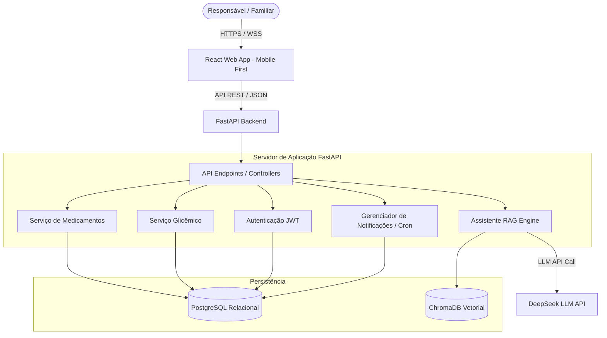

# Arquitetura do Sistema - Diabetes Guardian AI (Prompt 1)

Este documento descreve o projeto arquitetural completo da plataforma **Diabetes Guardian AI**, projetada para oferecer suporte clínico, educacional e organizacional a cuidadores e crianças com Diabetes Mellitus Tipo 1 (DM1).

## 1. Visão Geral da Arquitetura (Textual Diagram)

A plataforma adota uma arquitetura de microsserviços/camadas baseada em um backend robusto em FastAPI, um banco de dados relacional PostgreSQL, um banco vetorial ChromaDB para o mecanismo de RAG e um frontend web/mobile "future-ready".

---

## 2. Requisitos de Frontend (Mobile Future-Ready)

Para assegurar uma transição suave para um aplicativo nativo no futuro, adotamos as seguintes diretrizes:

*   **Mobile-First Design:** A interface web é projetada focando primariamente em telas de smartphones. Todos os componentes visuais são responsivos e utilizam breakpoints do Material UI adaptados para telas pequenas.
*   **Preparado para React Native (Future Migration):**
    *   **Separação Estrita de Lógica e Renderização:** Toda a lógica de negócios, chamadas de API, controle de estados (TanStack React Query) e hooks customizados são mantidos separados dos arquivos de renderização JSX/TSX.
    *   **Isolamento de Estilos:** Evitar estilos Inline complexos. Utilizar variáveis de tema CSS ou classes de estilo bem definidas para que a migração para `StyleSheet` do React Native envolva apenas a tradução de tags HTML/MUI para componentes primitivos (`View`, `Text`, `TouchableOpacity`).
*   **Componentes Reutilizáveis (Web/Mobile):** Criação de componentes funcionais "puros" baseados em propriedades (props). A camada de dados não conhece o motor de renderização.
*   **Design System Documentado:** Definição clara de cores institucionais baseadas em HSL (para fácil alternância de temas claro/escuro), tipografia (Roboto/Outfit), espaçamento de grades (grid de 8px) e guias de feedback tátil para interações em telas de toque.

---

## 3. Arquitetura do Backend (FastAPI)

*   **FastAPI & Python:** Framework assíncrono de alta performance ideal para conexões rápidas, integração nativa com Pydantic para validação de dados e OpenAPI automático.
*   **Arquitetura em Camadas:**
    1.  **Routers (API):** Exposição dos endpoints HTTP e documentação Swagger.
    2.  **Services/Business Logic:** Onde residem os algoritmos de cálculo de insulina, geração de alertas e integrações.
    3.  **Repositories/DAO:** Acesso ao banco de dados utilizando SQLAlchemy (Async).
    4.  **Models:** Definição das tabelas e esquemas de dados.

---

## 4. Casos de Uso Principais

1.  **Registro de Glicemia:** O usuário insere a glicemia atual, quantidade de carboidratos consumida, e o sistema calcula a dose sugerida de bolus com base no fator de sensibilidade e relação insulina/CHO.
2.  **Notificações de Medicamentos:** O sistema dispara alertas em tempo real sobre horários de aplicação de insulinas basais ou rápidas.
3.  **Apoio à Decisão via Chatbot IA:** O cuidador faz perguntas sobre sintomas ou procedimentos ("Meu filho está com glicose 60 e vai jogar futebol, o que faço?"), e a IA retorna respostas com alto nível de confiança baseadas nos documentos integrados e citações das diretrizes médicas.
