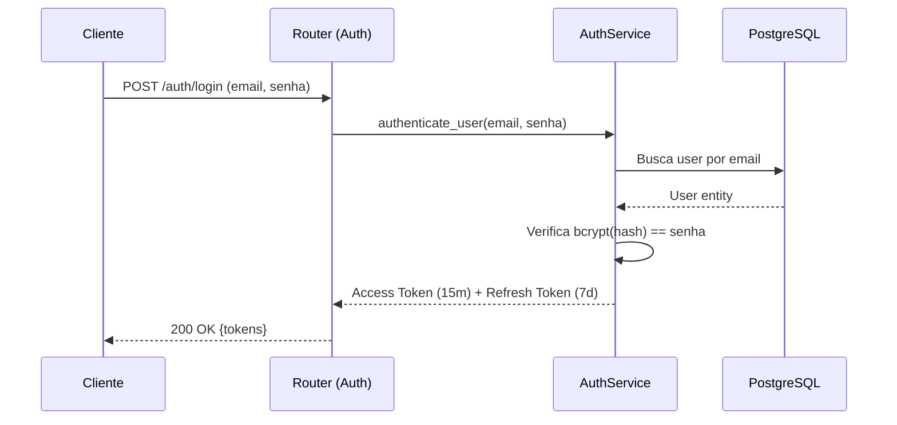
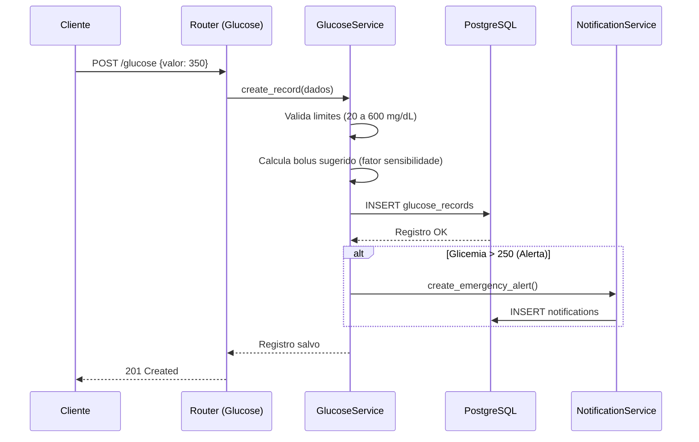
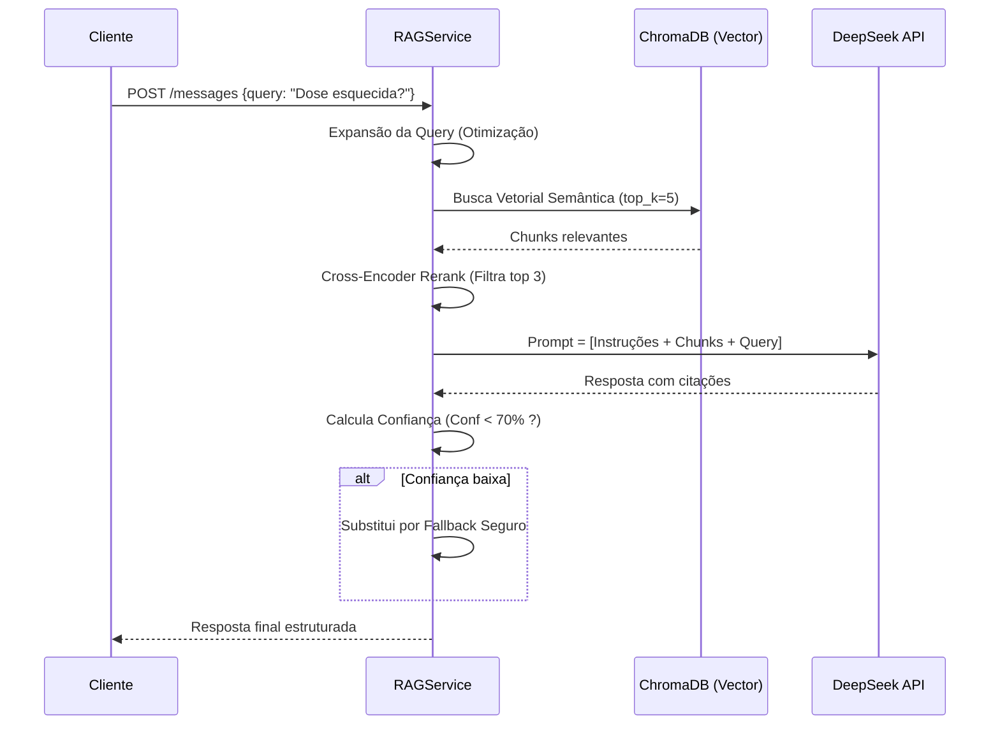

# Arquitetura do Backend - Diabetes Guardian AI (Prompt 4)

Este documento descreve detalhadamente o projeto arquitetural do backend para a plataforma **Diabetes Guardian AI**, utilizando FastAPI, PostgreSQL, SQLAlchemy, e integrando a engine de IA via RAG.

## 1. Estrutura de Pastas do Backend

A estrutura de diretórios adota um padrão em camadas (Layered Architecture) para promover a separação clara de responsabilidades, testabilidade e manutenibilidade:

```text
backend/
├── alembic/                 # Configurações e scripts de migração do banco de dados
│   ├── versions/            # Arquivos de migração gerados
│   └── env.py
├── app/                     # Código fonte principal
│   ├── api/
│   │   └── v1/              # Routers (Controllers) agrupados por versão da API
│   │       ├── auth.py
│   │       ├── users.py
│   │       ├── children.py
│   │       ├── medications.py
│   │       ├── schedules.py
│   │       ├── logs.py
│   │       ├── appointments.py
│   │       ├── exams.py
│   │       ├── glucose.py
│   │       ├── notifications.py
│   │       ├── chat.py
│   │       └── documents.py
│   ├── core/                # Configurações centrais do sistema
│   │   ├── config.py        # Carregamento de variáveis de ambiente (Pydantic BaseSettings)
│   │   ├── security.py      # Lógica de hashing (bcrypt) e JWT
│   │   └── database.py      # Conexão SQLAlchemy (AsyncEngine, session_maker)
│   ├── middleware/          # Middlewares globais
│   │   ├── error_handler.py # Captura global de exceções
│   │   ├── logging.py       # Interceptor para log de requisições
│   │   └── rate_limit.py    # Controle de tráfego por IP/Usuário
│   ├── models/              # Modelos ORM (SQLAlchemy)
│   │   ├── user.py
│   │   ├── child.py
│   │   └── ... (todas as 17 tabelas)
│   ├── repositories/        # Padrão Repository (acesso direto a dados)
│   │   ├── base.py          # CRUD genérico base
│   │   ├── user_repo.py
│   │   └── ...
│   ├── schemas/             # Validação de I/O via Pydantic v2
│   │   ├── user_schema.py
│   │   ├── child_schema.py
│   │   └── ...
│   ├── services/            # Lógica de Negócios (Business Rules)
│   │   ├── auth_service.py
│   │   ├── medication_service.py
│   │   ├── glucose_service.py
│   │   └── rag_service.py   # Orquestração do LangChain e DeepSeek
│   └── main.py              # Ponto de entrada (criação da app FastAPI, montagem de rotas)
├── tests/                   # Suíte de testes com Pytest
│   ├── e2e/                 # Testes end-to-end usando TestClient
│   ├── integration/         # Testes de integração (Repositories vs Test DB)
│   └── unit/                # Testes unitários (Services isolados com mocks)
├── .env.example
├── alembic.ini
└── requirements.txt
```

---

## 2. Descrição dos 12 Módulos

### 1. Auth
- **Responsabilidade:** Controle de identidade, acesso e renovação de sessões.
- **Endpoints:**
  - `POST /auth/register` (Registra usuário)
  - `POST /auth/login` (Autentica e retorna tokens)
  - `POST /auth/refresh` (Renova Access Token)
  - `POST /auth/logout` (Revoga tokens)
- **Service:** `AuthService` (verifica senhas, gera JWT).

### 2. Users
- **Responsabilidade:** Gestão do perfil do responsável.
- **Endpoints:**
  - `GET /users/me` (Busca dados próprios)
  - `PUT /users/me` (Atualiza perfil)
  - `DELETE /users/me` (Exclui conta e dados em cascata)
- **Service:** `UserService`.

### 3. Children
- **Responsabilidade:** Gerenciar perfis das crianças atreladas ao usuário.
- **Endpoints:**
  - `POST /children` (Cria criança)
  - `GET /children` (Lista crianças do usuário autenticado)
  - `GET /children/{id}` (Detalha criança)
  - `PUT /children/{id}` (Atualiza peso, idade)
- **Service:** `ChildService`.
- **Regras:** Um usuário só pode acessar/listar crianças cadastradas sob o seu próprio ID.

### 4. Medications
- **Responsabilidade:** Dicionário/catálogo de medicamentos da criança (ex: Insulina NPH).
- **Endpoints:**
  - `POST /medications`
  - `GET /medications`
  - `PUT /medications/{id}`
  - `DELETE /medications/{id}`
- **Service:** `MedicationService`.

### 5. MedicationSchedules
- **Responsabilidade:** Configurar como e quando um medicamento deve ser administrado.
- **Endpoints:**
  - `POST /schedules` (Agenda dose)
  - `GET /schedules?child_id={id}`
  - `PUT /schedules/{id}`
  - `DELETE /schedules/{id}`
- **Service:** `ScheduleService`.
- **Regras:** Ao criar um schedule, o service deve invocar a criação automática de `Notifications` (cron).

### 6. MedicationLogs
- **Responsabilidade:** Registrar o que efetivamente aconteceu com a dose agendada.
- **Endpoints:**
  - `POST /logs` (Registra dose: tomada, esquecida, cancelada)
  - `GET /logs?child_id={id}&start_date={d1}&end_date={d2}`
- **Service:** `LogService`.
- **Regras:** Medicamentos com logs ativos não podem ser excluídos fisicamente (uso obrigatório de soft delete).

### 7. Appointments
- **Responsabilidade:** Gestão de consultas médicas.
- **Endpoints:**
  - `POST /appointments`
  - `GET /appointments`
  - `PUT /appointments/{id}/reschedule`
  - `PUT /appointments/{id}/cancel`
- **Service:** `AppointmentService`.

### 8. AppointmentHistory
- **Responsabilidade:** Auditoria imutável de mudanças em consultas.
- **Integração:** Inserido automaticamente pelos métodos de cancelamento e reagendamento do `AppointmentService`.
- **Regras:** Ao reagendar, a data antiga deve ser obrigatoriamente persistida no histórico. Em cancelamentos, o motivo é obrigatório.

### 9. Exams
- **Responsabilidade:** Rastreio de pedidos laboratoriais e gravação de resultados numéricos.
- **Endpoints:**
  - `POST /exams` (Registra pedido)
  - `POST /exams/{id}/results` (Insere os dados coletados: HbA1c, colesterol, etc.)
  - `GET /exams`

### 10. GlucoseRecords
- **Responsabilidade:** Diário glicêmico e acompanhamento temporal.
- **Endpoints:**
  - `POST /glucose` (Registra medição)
  - `GET /glucose?child_id={id}`
- **Service:** `GlucoseService`.
- **Regras:** Validação crítica (a glicemia inserida DEVE estar entre 20 mg/dL e 600 mg/dL).

### 11. Notifications
- **Responsabilidade:** Listagem de lembretes e atualização de status de envio.
- **Endpoints:**
  - `GET /notifications` (Lista pendentes/ativas do usuário)
  - `PUT /notifications/{id}/read` (Marca como vista)
- **Service:** `NotificationService`. (Pode ser integrado a rotinas assíncronas nativas do FastAPI/Python).

### 12. AI Chat (RAG)
- **Responsabilidade:** Interação com o assistente inteligente usando contexto.
- **Endpoints:**
  - `POST /chat/sessions` (Inicia conversa)
  - `POST /chat/sessions/{id}/messages` (Envia pergunta e recebe resposta em SSE/JSON)
  - `GET /chat/sessions/{id}/messages` (Histórico)
- **Service:** `RAGService`.
- **Regras:** A resposta da IA deve conter citações. Se o score de confiança gerado for `< 70%`, ativa o mecanismo de *fallback seguro*.

### 13. Documents
- **Responsabilidade:** Gestão de uploads de PDFs/Markdown para enriquecer o vetor.
- **Endpoints:**
  - `POST /documents/upload`
  - `GET /documents`

---

## 3. Fluxos Internos

### Autenticação JWT


### Registro Glicêmico


### Consulta RAG (AI Chat)


---

## 4. Regras de Negócio Críticas

- **Restrição de Valor (Glicemia):** O sistema deve rejeitar (HTTP 422/400) registros de glicose inferiores a 20 mg/dL ou superiores a 600 mg/dL.
- **Exclusão Lógica Obrigatória:** Para tabelas como `Medications` e `Children`, não usar `DELETE` real se houver registros dependentes (`Logs`, `GlucoseRecords`). Alterar a coluna `deleted_at` (Soft Delete).
- **Gatilho de Notificação:** Sempre que um `MedicationSchedule` for criado ou atualizado, o sistema recalculará e inserirá automaticamente registros na tabela `Notifications` para envio nos horários corretos.
- **Histórico de Agendamentos:**
  - Cancelamento de `Appointment` exige motivo obrigatório.
  - Reagendamento não atualiza simplesmente o registro; ele clona o dado na tabela `AppointmentHistory` com a data/hora original e gera a nova agenda.
- **Segurança da IA:**
  - **Obrigatoriedade de Citação:** A LLM é orientada (via sistema) a inserir tags de fontes.
  - **Limiar de Segurança:** Se a busca vetorial não encontrar Similaridade por Cosseno $>$ 0.70, ou se a métrica combinada de validação cair para $< 70\%$, a IA ignorará a LLM e retornará o alerta fixo de "fallback".
- **Isolamento de Dados (Tenancy Pessoal):** Nas queries via Repository, é mandatório passar o `user_id` autenticado (obtido do token JWT). O sistema apensará `WHERE user_id = {auth_id}` silenciosamente.
- **Limite de Segurança Médica:** A dose inserida em um `MedicationSchedule` será validada contra um teto máximo configurável (ex: max X unidades por Kg do peso atual cadastrado na `Child`), visando prevenir overdose acidental de insulina.

---

## 5. Estratégias de Validação (Pydantic v2)

O FastAPI usa o Pydantic para sanear e validar todos os dados de entrada e saída.

**Exemplo - GlucoseRecord Schema:**
```python
# app/schemas/glucose_schema.py
from pydantic import BaseModel, Field, field_validator
from datetime import datetime

class GlucoseRecordCreate(BaseModel):
    child_id: str
    glucose_value: int = Field(..., description="Glicemia capilar ou sensor")
    measurement_type: str = Field(..., pattern="^(CAPILAR|SENSOR)$")
    carbs_grams: int | None = Field(default=0, ge=0)
    recorded_at: datetime
    
    @field_validator('glucose_value')
    @classmethod
    def validate_glucose_limits(cls, v: int) -> int:
        if v < 20 or v > 600:
            raise ValueError('Glicemia deve estar entre 20 e 600 mg/dL')
        return v
```

Padrão exigido por entidade:
1. `EntityCreate`: Campos obrigatórios para inserção. Sem IDs (gerados pelo banco).
2. `EntityUpdate`: Mesmos campos, porém todos como `Optional` (`| None`).
3. `EntityResponse`: Adiciona `id`, `created_at`, `deleted_at`. Usa `model_config = ConfigDict(from_attributes=True)` para serializar o ORM SQLAlchemy.

---

## 6. Segurança

A segurança dos dados médicos é garantida através de múltiplas camadas:
- **Autenticação JWT:** Access Tokens com vida curta (15 minutos) mitigam roubo de sessão. Refresh Tokens (7 dias) mantêm o usuário logado de forma amigável no app mobile.
- **Hashing de Senhas:** Senhas são salvas no PostgreSQL processadas via bcrypt (biblioteca `passlib`).
- **Rate Limiting:** Prevenção de ataques de força bruta no `/auth/login` (ex: máx 5 tentativas por minuto via middleware).
- **Proteção de Injeção:** A utilização rigorosa do SQLAlchemy ORM previne SQL Injection.
- **CORS Estrito:** A API aceitará requisições apenas de domínios configurados (origins confiáveis do React frontend e apps mobile autorizados).
- **Controle de Acesso (RBAC):** Middleware de segurança `get_current_user` será injetado (`Depends()`) em todas as rotas protegidas. No futuro, haverá a permissão `ROLE_DOCTOR` para visão consolidada de múltiplos pacientes.

---

## 7. Tratamento de Erros

Em vez de lançar `HTTPException` cruas, a arquitetura implementa uma hierarquia de classes e um exception handler global para manter uniformidade:

- **BaseAppException:** Classe pai contendo código HTTP e mensagem amigável.
- **Herdadas:** `NotFoundException` (404), `ForbiddenException` (403), `ValidationException` (422).

**Resposta de Erro Padronizada (JSON):**
```json
{
  "error": {
    "code": "VALIDATION_ERROR",
    "message": "Dados de entrada incorretos.",
    "details": [
      {
        "field": "glucose_value",
        "issue": "Glicemia deve estar entre 20 e 600 mg/dL"
      }
    ]
  }
}
```

---

## 8. Estratégia de Testes

Para garantir a confiabilidade de um software de saúde crítico:

- **Testes Unitários:** Concentrados na camada `app/services/`. Dependências de banco de dados e APIs externas (DeepSeek) são substituídas por Mocks via `unittest.mock`. Principal foco de teste: algoritmo de cálculo de dose baseada em carboidratos.
- **Testes de Integração:** Concentrados na camada `app/repositories/`. Utilizam pytest-asyncio para certificar o funcionamento das queries e gatilhos.
- **Testes End-to-End (E2E):** Disparam requisições completas para os endpoints usando a classe `TestClient` fornecida pelo FastAPI.
- **Cobertura Mínima Exigida:** 80% do código medido via `pytest-cov`, sendo 100% de exigência nos serviços de cálculos e lógica do RAG.
