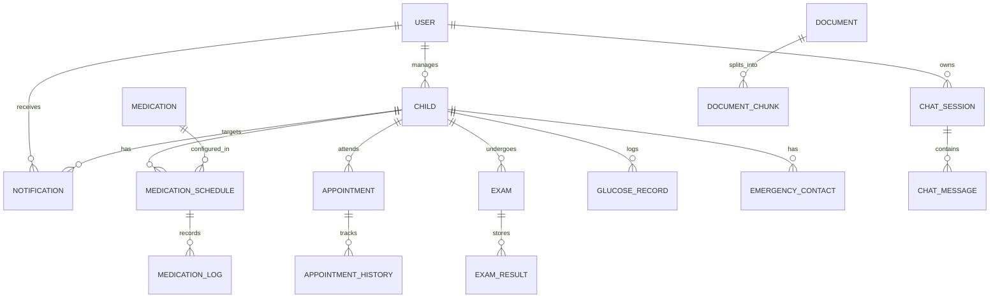

# Modelagem do Banco de Dados - Diabetes Guardian AI (Prompt 3)

Este documento descreve o projeto de banco de dados relacional utilizando o PostgreSQL, detalhando a arquitetura das tabelas, relacionamentos, mecanismos de auditoria, soft delete e estratégias de performance.

---

## 1. Diagrama Entidade-Relacionamento Textual (DER)

Abaixo está a representação textual dos relacionamentos lógicos do banco de dados utilizando sintaxe compatível com Mermaid:

---

## 2. Entidades Principais e Relacionamentos

### 2.1 Gestão de Contas e Crianças
*   **User:** Cadastro de pais/responsáveis (nome, email criptografado, hash de senha, telefone). Relacionamento $1:N$ com `Child`.
*   **Child:** Cadastro da criança/adolescente com DM1 (nome, data de nascimento, peso, data de diagnóstico). Vinculado a registros glicêmicos e agendamentos.
*   **EmergencyContact:** Telefones e contatos rápidos (ex: médico, escola, avós) vinculados a uma criança.

### 2.2 Gestão de Medicamentos
*   **Medication:** Tabela base de insumos (Tipos de insulina como Glargina, Humalog, ou outros medicamentos).
*   **MedicationSchedule:** Agendamentos de dosagem (dose padrão, horários, relação carboidrato, fator de sensibilidade).
*   **MedicationLog:** Registro de execução. Contém o status (`TOMADO`, `ESQUECIDO`, `CANCELADO`) para auditoria da rotina de aplicação.

### 2.3 Gestão de Consultas e Exames
*   **Appointment:** Controle de consultas médicas (data, hora, profissional, especialidade, status).
*   **AppointmentHistory:** Log de alterações (criação, reagendamento com data anterior/nova, cancelamento).
*   **Exam e ExamResult:** Controle de pedidos de exames laboratoriais e arquivamento de resultados numéricos (ex: Hemoglobina Glicada HbA1c, microalbuminúria).

### 2.4 Registros Clínicos e IA
*   **GlucoseRecord:** Registros de glicemia capilar/sensor, insulina aplicada (bolus correção/alimentação), carboidratos ingeridos e notas de atividade física.
*   **ChatSession e ChatMessage:** Histórico de conversas do assistente RAG.
*   **Document e DocumentChunk:** Tabelas de suporte do RAG para rastreamento de arquivos originais da base de conhecimento e seus respectivos pedaços indexados no ChromaDB.

### 2.5 Sistema de Notificações
*   **Notification:** Tabela que armazena as notificações agendadas e enviadas.
    *   `id`: Identificador único UUID.
    *   `user_id`: Usuário responsável associado.
    *   `child_id`: Criança relacionada à notificação (opcional).
    *   `type`: Tipo (`MEDICAMENTO`, `CONSULTA`, `ALERTA_GLICEMIA`, `SISTEMA`).
    *   `title`: Título da notificação.
    *   `message`: Conteúdo da mensagem.
    *   `scheduled_at`: Data e hora programada para envio.
    *   `sent_at`: Data e hora em que foi efetivamente enviada (nulo se pendente).
    *   `status`: Status do envio (`PENDENTE`, `ENVIADO`, `FALHOU`, `CANCELADO`).
    *   `created_at`: Data de inserção do registro.

---

## 3. Estratégias de Auditoria e Soft Delete

1.  **Soft Delete:** Todas as entidades principais contêm a coluna `deleted_at` (timestamp, nulo por padrão). Exclusões lógicas são feitas definindo essa coluna, e consultas comuns filtram registros onde `deleted_at IS NULL` para evitar perda de histórico clínico.
2.  **Tabelas de Auditoria e Triggers:** Usamos triggers nativos do PostgreSQL para registrar de forma automática todas as inserções e alterações críticas de dosagem de medicamentos na tabela `medication_schedule_history`.
