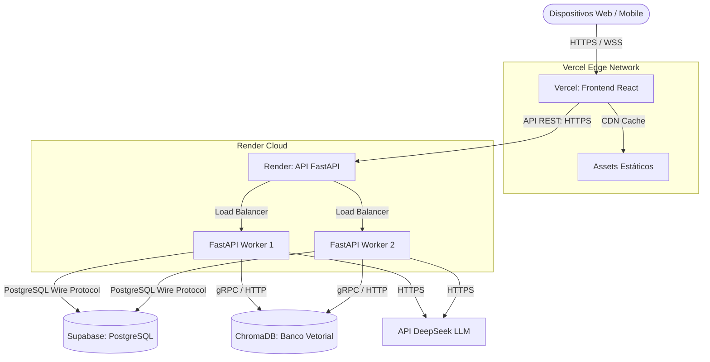

# Arquitetura de Implantação - Diabetes Guardian AI

Este documento detalha a estratégia de implantação em produção (Deployment) do **Diabetes Guardian AI**, abordando a infraestrutura, o fluxo de requisições, a comunicação entre serviços e as táticas de escalabilidade.

## 1. Visão Geral da Infraestrutura

A infraestrutura foi desenhada para maximizar a disponibilidade, garantir segurança médica (proteção de dados sensíveis) e facilitar a escalabilidade sob demanda. Utilizamos serviços gerenciados PaaS (Platform as a Service) modernos:

- **Frontend:** Vercel (Edge Network / CDN global).
- **Backend:** Render (Web Service com Auto-scaling).
- **Banco de Dados Relacional:** Supabase (PostgreSQL gerenciado).
- **Banco Vetorial (RAG):** Instância dedicada (ex: Pinecone ou ChromaDB auto-hospedado no Render via Docker).
- **LLM API:** DeepSeek API.

## 2. Diagrama Textual da Arquitetura de Produção

## 3. Fluxo Completo de Requisições

1. **Acesso ao Frontend:** O usuário acessa a aplicação. O Vercel entrega a aplicação React através do CDN mais próximo geograficamente, garantindo latência mínima no carregamento inicial.
2. **Autenticação e API:** O frontend faz requisições assíncronas para a API hospedada no Render (`api.diabetesguardian.com`). O Render atua como um Load Balancer, distribuindo o tráfego entre os *workers* do FastAPI.
3. **Persistência Relacional:** O FastAPI processa a regra de negócios (ex: cálculo de bolus de insulina) e interage com o banco Supabase PostgreSQL para ler ou gravar dados. A comunicação é encriptada.
4. **Fluxo RAG (Assistente IA):**
   - A requisição de chat chega à API no Render.
   - O FastAPI converte a pergunta em embeddings e consulta o ChromaDB para recuperar o contexto médico mais relevante.
   - O backend compõe o *prompt* com o contexto retornado e envia à API do DeepSeek.
   - A resposta da LLM é tratada e enviada de volta ao cliente, potencialmente usando SSE (Server-Sent Events) para *streaming*.

## 4. Comunicação entre Frontend, Backend, Banco e IA

- **Frontend <-> Backend:** Comunicação exclusiva via protocolo HTTPS (RESTful APIs). O uso de Server-Sent Events (SSE) ou WebSockets (WSS) é empregado para streaming de respostas da IA e notificações em tempo real. Os dados são serializados em JSON e protegidos por tokens JWT trafegados nos *headers* de autorização.
- **Backend <-> Supabase (PostgreSQL):** Utiliza-se um *pooler* de conexões nativo do Supabase (PgBouncer) para evitar o esgotamento de conexões quando o FastAPI escalar. A comunicação é síncrona via driver SQLAlchemy assíncrono (asyncpg).
- **Backend <-> Banco Vetorial (ChromaDB):** Conexão interna rápida (geralmente mesma VPC ou HTTP local dependendo do deploy do ChromaDB).
- **Backend <-> DeepSeek API:** Requisições HTTP (HTTPS) seguras utilizando chaves de API restritas via variáveis de ambiente.

## 5. Estratégia de Escalabilidade

- **Frontend (Vercel):** Escalabilidade infinita "out-of-the-box" via CDN Edge Network da Vercel. Picos de tráfego são absorvidos globalmente sem impacto no origin server.
- **Backend (Render):** 
  - *Horizontal Pod Autoscaling:* O Render monitora o consumo de CPU e Memória da instância. Ao atingir o limite pré-configurado (ex: 75% CPU), novas instâncias do FastAPI (workers) são ativadas (Scale-out).
  - *Stateless:* O backend não armazena estado de sessão; os JWTs garantem que qualquer instância possa atender qualquer requisição.
- **Banco de Dados (Supabase):** 
  - *Connection Pooling:* O PgBouncer impede o esgotamento das conexões.
  - *Read Replicas:* Em caso de alto volume de leituras (ex: consultas de histórico), podem ser ativadas réplicas de leitura para desafogar o banco de escrita (Primary DB).
- **Banco Vetorial:** Caso o RAG exija mais performance, a transição de um ChromaDB local/container para uma solução gerenciada robusta (como Pinecone ou Weaviate Cloud) pode ser feita alterando apenas as variáveis de ambiente e a classe de inicialização do RAG.
